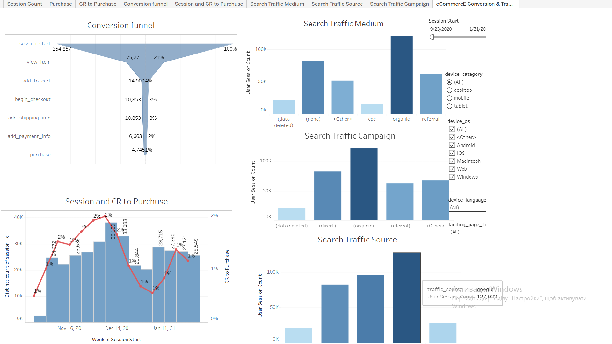

# Аналіз конверсій інтернет-магазину (Ecommerce Funnel) на основі даних GA4 за допомогою BigQuery SQL та Tableau

## Мета проєкту
Створення багатосторінкового інтерактивного аналітичного дашборду для відділу маркетингу з метою оцінки ефективності воронки конверсій (Ecommerce Funnel) на основі публічного датасету GA4 в BigQuery. Проєкт дозволяє аналізувати динаміку сесій, коливання конверсії та детально досліджувати джерела залучення користувачів.

## Інструменти та технологічний стек
* SQL (Google BigQuery): Екстракція, очищення комерційних логів Google Analytics 4, розрахунок послідовних кроків сесійної воронки за допомогою LEFT JOIN, робота з масивами (`UNNEST`) та регулярними виразами (`REGEXP_EXTRACT`).
* Tableau Public: Побудова інтерактивного дашборду, створення комбінованих графіків (Dual Axis) та налаштування динамічних бічних фільтрів.

## Результати проєкту
* Код із SQL-запитом: Знаходиться у файлі ga4_code.txt у цьому репозиторії.
* Інтерактивний звіт в Tableau: Посилання на Tableau Public буде додано найближчим часом.

### Візуалізація дашборду в Tableau:

## Structure та архітектура аналітичного центру
Дашборд спроєктований за класичними принципами корпоративної візуалізації та містить такі вкладки та блоки:
* **Вкладки аналізу:** Session Count, Purchase, CR to Purchase, Conversion funnel, Session and CR to Purchase, Search Traffic (Medium, Source, Campaign).
* **Головна воронка (Conversion funnel):** Наочна 7-рівнева лійка конверсії (від session_start із 354,857 сесій до фінального purchase з коефіцієнтом утримання на кожному кроці).
* **Аналітика трендів (Session and CR to Purchase):** Таймлайн-графік (Dual Axis), що відображає щотижневу динаміку унікальних сесій разом із лінією Conversion Rate для відстеження маркетингових сплесків.
* **Сегментація трафіку:** Інтерактивні стовпчикові діаграми для детального аналізу Search Traffic Medium, Campaign та Source.
* **Динамічні фільтри бічної панелі:** Фільтрація за часом (Session Start), категоріями пристроїв (device_category), операційними системами (device_os), мовою користувача (device_language) та посадковими сторінками (landing_page).

## Бізнес-цінність проєкту
Завдяки комбінації графіків воронки та обсягів трафіку, маркетологи компанії можуть за 5 секунд оцінити ефективність рекламних кампаній. Дашборд наочно демонструє, які канали (наприклад, organic чи referral) приносять найбільший обсяг трафіку, та на якому саме етапі оформлення замовлення користувачі найчастіше покидають кошик.
